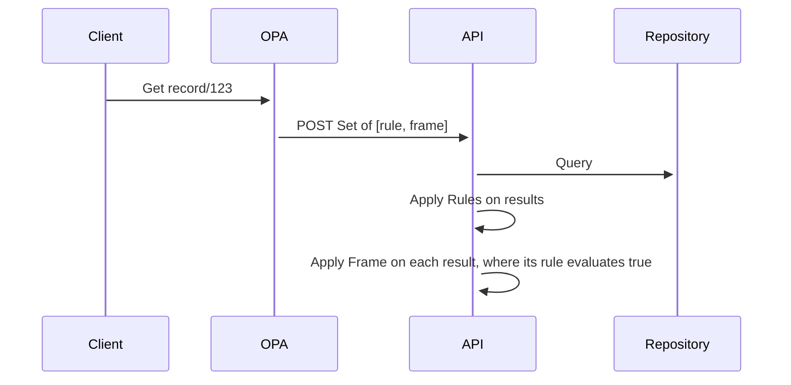

# Thoughts on OPA compatibility

Authentication should be handled upstream by an opa policy agent. While easy for standard authorization for 
API endpoints, this could be tricky for item-level authorization. 

Let's consider the following example: 

````json
{
  "@context": {"@vocab": "http://av360.io/schema/maverick"},
  "@graph": [{
    "@id": ":record/632",
    "@type": "Record",
    "unit": ":unit/f3r",
    "contains": {
      "@id": "case/2342",
      "@type": "Case",
      "creator": ":user/3fe32",
      "title": "Business Report 2022",
      "contains": [
        {
          "@id": "document/632",
          "@type": "Report",
          "status": "draft"
        }, {
          "@id": "document/633",
          "@type": "Receipt",
          "status": "deleted"
        }
      ]
    }
  }]
}

````

The security rules are: 

* User U1 with the role "member" has access to all records, cases and documents of his own unit
* User U2 from a different unit has access to the record, but not to their content (cases and accordingly documents)
* User U3 with the role "guest" for the unit can also access the cases and documents with the status "final"
* User U4 with the role "admin" in the  unit can see deleted documents (status is "deleted")

## Prevent access to embedded elements through frames
During policy enforcement we don't have access to the data, during fetching and constructing the response we don't have access to the user role. 

But: OPA can manipulate the frame! 

The request ``GET /api/entities/vocab/records/632`` would return, by default, the object listed above. But OPA could rewrite the query 
and choose a preconfigured template suitable for the current user role. 

The frame for user U2 would be: 

````json

{
  "@context": {"@vocab": "http://av360.io/schema/maverick"},
  "@type": "Record",
  "@id": ":record/632",
  "@embed": "@never",
  "unit": {
    "@Id": ":unit/f3r" 
  }
}
````

The result would be in this case
````json
{
  "@context": {
    "@vocab": "http://av360.io/schema/maverick"
  },
  "@id": ":record/632",
  "@type": "Record",
  "contains": {
    "@id": "case/2342"
  },
  "unit": ":unit/f3r"
}
````

But: OPA still needs to know the unit assigned to the record. Which means: 

- either we forbid the GET request and require the unit in the POST request (kind of works for navigation, but defeats the purpose of shared links)
- we store the associations between units and records in-memory in OPA (can be a lot)


Note that units can change, it cannot be part of the id or the links, create from the ids. 

A potential workaround would be a list of frames, which are applied to the result(-set). Let's say user U2 is in the unit "unit:2f2". 
OPA could send the two following frames: 

````json
[
  {
    "@context": {
      "@vocab": "http://av360.io/schema/maverick"
    },
    "@type": "Record",
    "@id": ":record/632",
    "@embed": "@never",
    "unit": {
      "@Id": {
        "@not": ":unit/f3r"
      }
    }
  },
  {
    "@context": {"@vocab": "http://av360.io/schema/maverick"},
    "@type": "Record",
    "@id": ":record/632",
    "@embed": "@always",
    "unit": {
      "@Id": ":unit/f3r"
    }
  }
]


  


````
The "@not" rule is does not exist in the spec, though. 

Summary: it seems frame rewriting can omit certain details, but it fails
- to hide the attributes on the top node (we can only omit embedded entities)
- to add constraints or rules


## Prevent access to elements by attribute value with frames
With frames we can apply value matching, but not value hiding. Let's say U3 is accessing the record with the frame
````json
  {
    "@context": {"@vocab": "http://av360.io/schema/maverick"},
    "@type": "Record",
    "@id": ":record/632"
  }
````

and gets as default the result (try it on the json-ld playground)

````json
{
  "@context": {
    "@vocab": "http://av360.io/schema/maverick"
  },
  "@id": ":record/632",
  "@type": "Record",
  "contains": {
    "@id": "case/2342",
    "@type": "Case",
    "contains": {
      "@id": "document/632",
      "@type": "Receipt",
      "status": "deleted"
    },
    "creator": ":user/3fe32",
    "title": "Business Report 2022"
  },
  "unit": ":unit/f3r"
}
````

But since the document has been deleted, the user U3 should not be able to see it. 

With the following frame, we could limit the result to specific status values

````json
  {
    "@context": {"@vocab": "http://av360.io/schema/maverick"},
    "@type": "Record",
    "@id": ":record/632",
    "contains": {
      "contains": {
        "status": {"@value": "final" }, 
        "status": {"@value": "draft" }
  	}
  }
  }
````
It works in the Playground, but it is invalid json and feels like a hack

## Prevent access to embedded elements through constraints
Ok, let's forget frame rewriting. Since we have some experience with constraints with the Spring expression language (SPEL), we can try the same 
with [Json Paths](https://github.com/json-path/JsonPath) and its filter capabilities. 


For the request ``GET /api/entities/vocab/records/632``, OPA would add the following constraints to the header (or respond in its evaluation): 

For user U1 (who is in ``unit/f3r` and can see it)
````
$[?(@.unit=~/.*unit/f3r/i]
````
Since this expression evaluates to true, it will be returned. For user U2 from ``unit:2f2``, the rule 

````
$[?(@.unit=~/.*unit/2f2/i]
````

would evaluate to false. Which means, he cannot see it at all (but we wanted to just limit his view)

## Combining Frames with Paths. 

Ok, it seems we have to combine the frames with the json paths in the following sequence




## Security Pruning of query results
